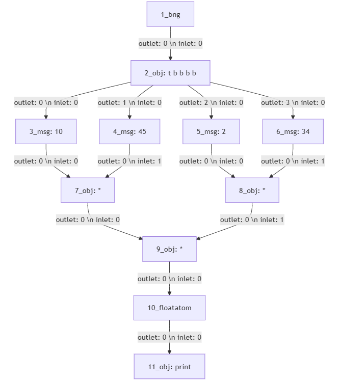

# GSoC'24 Final Project Report 
| | |
|------------------------|--------------------------------------------|
| **Name**               | Amrut Kotrannavar                          |
| **Organization**       | Purr Data                                  |
| **Project Title**      | Generating Pd patches using an LLM          |
| **Project Duration**   | 20 Weeks                                   |
| **Mentors**            | Jonathan Wilkes, Albert Gräf, Matt Barber  |
|||

# Project Overview

The objective of the project, **"Generating Purr Data (Pd) Patches Using an LLM"** was to employ an open-source language model to generate Pd patches from natural language inputs. This aims to simplify the patch creation process in Pd, a visual programming language for multimedia projects.

## Documentation

For detailed project documentation visit [PatchGen Docs](https://anxiousant.github.io/PatchGen-Docs/#/).

## Video Demonstration

<video controls src="_images/PatchGen-Demo-vid.mp4" title="Model demo" width = "900" controls autoplay muted loop></video>

## Project Details

### 1. Data Collection / Annotation

#### Pretraining Dataset
- **Dataset Size:** 39,000 Pd patches
- **Source:** The dataset was compiled from various sources, including the [pd-list (community archive)](https://puredata.info/community/lists), [official repository](https://git.purrdata.net/jwilkes/purr-data), [pdpatchrepo](https://forum.pdpatchrepo.info/), [bigcode/the-stack dataset](https://huggingface.co/datasets/bigcode/the-stack/tree/main/data/pure-data) and other community-driven sources.
- **Purpose:** This dataset exposed the model to a variety of Pd patch structures, helping it learn the fundamental syntax and object relationships.
- **links:**  [ParZiVal04/pd-patches-14k-dataset](https://huggingface.co/datasets/ParZiVal04/Pd-patches-14k-dataset), [ParZiVal04/pd-patches-dataset (39k)](https://huggingface.co/datasets/ParZiVal04/pd-patches-dataset)

#### Instruction Fine-Tuning Dataset
- **Dataset Size:** 3,000 annotated examples
- **Source:** The dataset paired each Pd patch with a natural language prompt and an explanation of the patch’s functionality.
- **Purpose:** This dataset was crucial for teaching the model to generate Pd patches based on natural language descriptions.
- **link:**  [parzi-parzi/patch-gen-dataset-v0.8.7](https://huggingface.co/datasets/parzi-parzi/patch-gen-dataset-v0.8.7)


### 2. Implementation

The project was divided into two training phases using the **Mistral 7B** model:

#### Phase 1: Continued Pretraining
- **Objective:** This phase involved training the model on **14,000 Pd patches**, exposing it to the syntax and structure of Pd. The model learned how Pd patches are constructed, including objects, messages, and connections.
- **Training Method:** Continued pretraining was performed using qLoRA (quantized Low-Rank Adaptation).
- **Training Duration:** ~20 hours on a **Tesla T4 GPU**.

#### Phase 2: Instruction Fine-Tuning
- **Objective:** The second phase fine-tuned the model on a smaller dataset of **3,000 annotated examples**, where each example paired a natural language prompt with its corresponding Pd patch. This phase was designed to teach the model to generate patches based on specific user-provided descriptions.
- **Training Duration:** ~12 hours on a **Tesla T4 GPU**.


### 3. Model Inference

The project provides two primary inference modes:
- **Custom Prompts:** Users can input custom prompts, and the model will generate Pd patches based on the text. The quality of the generated patches can be limited, particularly for complex requests.
- **Random Patch Generation:** The model can also generate patches using random prompts from the training data, producing more accurate results since the model has been previously exposed to these examples.

### 4. Local Inference Setup

The project includes instructions for setting up the model for local inference using **Ollama**. Users can clone the project repository, download the PatchGen model, and interact with the model through a menu based user interface.

## Additional Features

### Alternate Patch Representations

To improve the learnability of patch structures, the project incorporated an algorithm that sorts Pd patch records based on spatial coordinates (topological sorting). This reordering creates a more consistent and learnable representation for the model, enhancing its ability to understand object relationships within patches.

Example of a patch file before and after reordering:

**Before Reordering:**
```plaintext
#N canvas 962 288 452 302 10;
#X obj 150 230 print;
#X obj 150 160 +;
#X obj 150 70 t b b;
#X msg 150 110 1;
#X msg 180 110 2;
#X obj 150 50 bng 15 250 50 0 empty empty empty 17 7 0 10 #fcfcfc #000000
#000000;
#X floatatom 150 190 5 0 0 0 - - -, f 5;
#X connect 1 0 6 0;
#X connect 2 0 3 0;
#X connect 2 1 4 0;
#X connect 3 0 1 0;
#X connect 4 0 1 1;
#X connect 5 0 2 0;
#X connect 6 0 0 0;
```

**After Reordering:**
```plaintext
#N canvas 510 289 454 305 10;
#X obj 140 47 bng 15 250 50 0 empty empty empty 17 7 0 10 #fcfcfc #000000
#000000;
#X obj 140 70 t b b;
#X msg 140 120 1;
#X msg 170 120 2;
#X obj 140 170 +;
#X floatatom 140 200 5 0 0 0 - - -, f 5;
#X obj 140 240 print;
#X connect 0 0 1 0;
#X connect 1 0 2 0;
#X connect 1 1 3 0;
#X connect 2 0 4 0;
#X connect 3 0 4 1;
#X connect 4 0 5 0;
#X connect 5 0 6 0;
```
This alternate representation potentially offers a more consistent structure for the model to learn from, with objects appearing in a predictable order based on their visual layout in the patch.

#### **Mermaid Diagrams**
I also experimented with Mermaid diagrams to visualize connections between objects in Pd patches. This isn't utilized in the project but it's something I would like to explore more in the future. Here's a pd patch represented as a mermaid flowchart.




### Data Analysis & Word Clouds
The project included [data visualizations](insights.md) such as sunburst charts and word clouds to analyze the training dataset’s structure. These visualizations provided insights into the most frequent terms and common patterns used in the instructions given to the model.

## Current Model Performance

The model demonstrates a solid grasp of Pd syntax and is able to generate some simple patches, but it faces challenges in accurately converting natural language descriptions into functional patches. This limitation is primarily due to the limited number of annotated examples, leading to some inconsistencies when handling complex or abstract prompts.

## Code Integration

The project was an independent effort, and no code was merged upstream into existing repositories. The entire work remains standalone and fully open-source, allowing for future collaboration and expansion by the community.

## Future Work

- **Further Training:** The model requires additional fine-tuning on a broader and more diverse set of annotated examples to improve its ability to handle a wider range of natural language descriptions and generate more accurate patches.

- **Community Engagement:** Establishing an online forum would enable users to share successful prompts, discuss challenges, and contribute new examples to expand the training dataset. This forum could also be a hub for collecting more training data, which would help further improve the model’s performance.

## Acknowledgements

I had a great time working on this project and I’d like to sincerely thank my mentors Jonathan Wilkes, Albert Gräf and Matt Barber for their support throughout the course of the project. I’m truly grateful for their time, feedback, and encouragement, which helped me achieve my goals and learn a ton along the way.


