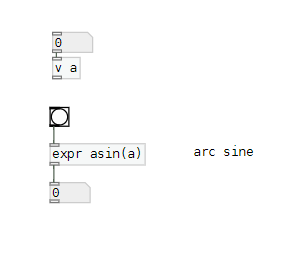
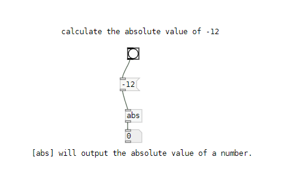
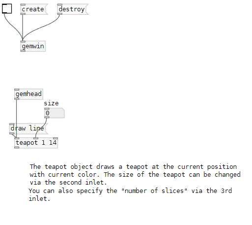
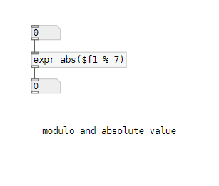
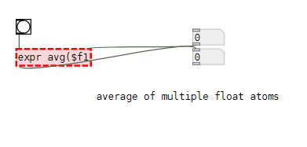
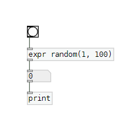

# Model Test Results

The **PatchGen** model was tested with various natural language prompts to assess its ability to generate valid and functional Pure Data (Pd) patches. Below are some test cases, where each prompt was given to the model, and its corresponding Pd patch was generated and visualized as an image. Additionally, the model provided explanations for each patch, describing how it works and what each component does.

| Index | Prompt                                                                                    | Generated Patch                                                         | Explanation                                                                                              |
|-------|-------------------------------------------------------------------------------------------|-------------------------------------------------------------------------|----------------------------------------------------------------------------------------------------------|
| 1     | Create a Pure Data patch that accepts a floating-point input and outputs the arc sine of the number, with a button to perform the calculation.  |  |This patch takes a floating-point input, stores it in a variable 'a', and then uses the 'expr' object to calculate the arc sine of the number when a button is clicked. The result is displayed in a float atom.|
| 2     | Create a Pure Data patch that calculates the absolute value of a given negative number.   |                 |This patch calculates a mathematical expression involving power functions. It takes two input numbers, squares the first one, calculates the square root of the second one, adds the results together, and outputs the final value.|
| 3     | Create a Pure Data patch that generates a 3D teapot with customizable size and detail level.   |         |This patch creates a 3D teapot using the 'teapot' object, with adjustable size and detail level. The teapot is drawn at the current position with the current color, and the number of slices can be specified via the third inlet.|
| 4     | Create a Pure Data patch that accepts a floating-point number, calculates its absolute value modulo 7, and displays the output.|   |This patch takes a floating-point input, calculates its absolute value modulo 7 using the expr object, and displays the result in a floatatom.|
| 5    | Create a Pure Data patch that takes a list of numbers, calculates their average, and outputs the result.|   |This patch calculates the average of multiple float atoms using the 'expr' object and outputs the result. It takes input from multiple float atoms, calculates their average, and displays the result in a float atom.|
| 6     | Create a Pure Data patch that generates random values between 1 and 100 and prints them whenever a bang is triggered. | | This patch uses a bang object to trigger an expression that generates a random value between 1 and 100, which is then printed to the console. |
